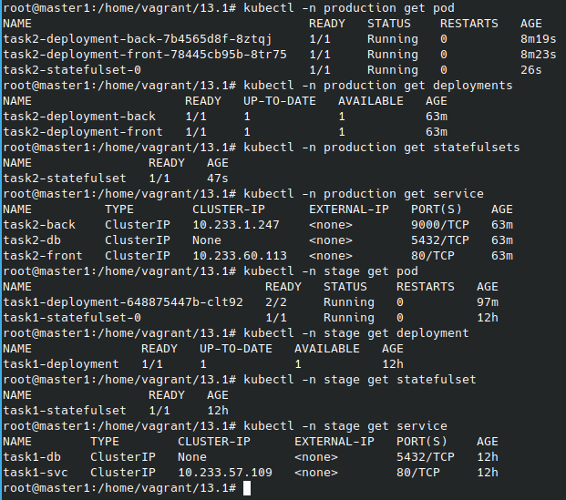

# Домашнее задание к занятию "13.1 контейнеры, поды, deployment, statefulset, services, endpoints"

## Модуль 13. Конфигурация Kubernetes

### Студент: Иван Жиляев

>Настроив кластер, подготовьте приложение к запуску в нём. Приложение стандартное: бекенд, фронтенд, база данных (пример можно найти в папке [13-kubernetes-config](../13-kubernetes-config/)).

## Задание 1: подготовить тестовый конфиг для запуска приложения
>Для начала следует подготовить запуск приложения в stage окружении с простыми настройками. Требования:
>* под содержит в себе 3 контейнера — фронтенд, бекенд, базу;
>* регулируется с помощью deployment фронтенд и бекенд;
>* база данных — через statefulset.

Соберём и поместим образы в репозиторий командами:

```
cd ../13-kubernetes-config/
docker build backend/ -t nimlock/netology-homework-13.xx-backend:stage
docker build frontend/ -t nimlock/netology-homework-13.xx-frontend:stage
docker push nimlock/netology-homework-13.xx-backend:stage
docker push nimlock/netology-homework-13.xx-frontend:stage
```

Разделим окружения `stage` и `production` за счёт использования различных неймспейсов для создаваемых сущностей k8s.

Для создания сущностей, относящихся к неймспейсу `stage`, были созданы манифесты [task1-cm.yaml](task1-cm.yaml), [task1-deployment.yaml](task1-deployment.yaml), [task1-ingress.yaml](task1-ingress.yaml), [task1-ns.yaml](task1-ns.yaml), [task1-statefulset.yaml](task1-statefulset.yaml), [task1-svc.yaml](task1-svc.yaml).

Создадим объекты командой по шаблону `kubectl apply -f ${task1-.+.yaml}`.

Для проверки работы сервиса я определил его URL в [task1-ingress.yaml](task1-ingress.yaml) равный `task1.13-1.netology`. Его же я добавлю в локальный файл `/etc/hosts` и теперь можно убедиться, что сервис работает пройдя по ссылке [http://task1.13-1.netology](http://task1.13-1.netology).

Примечание: мне пришлось несколько изменить принципы маршрутизации запросов, чтобы не создавать лишних служб в k8s. Так, для фронта вместо прямого запроса к бэку с клиентской части я задал в [13-kubernetes-config/frontend/.env](../13-kubernetes-config/frontend/.env) `BASE_URL=http://task1.13-1.netology` (по логике приложения от `BASE_URL` строятся адреса запросов к бэку). В то же время сам бэк я спрятал за прокси добавив в [13-kubernetes-config/frontend/demo.conf](../13-kubernetes-config/frontend/demo.conf) такой локейшн:

```
    location /api/ {
        proxy_pass http://localhost:9000;
    }
```

## Задание 2: подготовить конфиг для production окружения
>Следующим шагом будет запуск приложения в production окружении. Требования сложнее:
>* каждый компонент (база, бекенд, фронтенд) запускаются в своем поде, регулируются отдельными deployment’ами;
>* для связи используются service (у каждого компонента свой);
>* в окружении фронта прописан адрес сервиса бекенда;
>* в окружении бекенда прописан адрес сервиса базы данных.

Для прод-окружения изменим параметры в исходниках и пересоберём образы (к сожалению, фронт написан так, что фиксирует переменную `BASE_URL` при сборке; переписать его не хватило времени/знаний).

```
cd ../13-kubernetes-config/
docker build backend/ -t nimlock/netology-homework-13.xx-backend:production
docker build frontend/ -t nimlock/netology-homework-13.xx-frontend:production
docker push nimlock/netology-homework-13.xx-backend:production
docker push nimlock/netology-homework-13.xx-frontend:production
```

Для работы маршрутизации запров для прод-окружения в исходниках были исправлены:

1. Переменная для сборки фронта `BASE_URL=http://task2.13-1.netology`
1. Локейшн для работы с бэком:
    ```
        location /api/ {
            proxy_pass http://task2-back.production:9000;
            proxy_cache off;
        }
    ```

На основе готовых манифестов для `stage` были созданы манифесты для `production`: [task2-cm.yaml](task2-cm.yaml), [task2-deployment.yaml](task2-deployment.yaml), [task2-ingress.yaml](task2-ingress.yaml), [task2-ns.yaml](task2-ns.yaml), [task2-statefulset.yaml](task2-statefulset.yaml), [task2-svc.yaml](task2-svc.yaml).

Создадим объекты командой по шаблону `kubectl apply -f ${task2-.+.yaml}`.

Проверить сервис можно пройдя по ссылке [http://task2.13-1.netology](http://task2.13-1.netology).

## Задание 3 (*): добавить endpoint на внешний ресурс api
>Приложению потребовалось внешнее api, и для его использования лучше добавить endpoint в кластер, направленный на это api. Требования:
>* добавлен endpoint до внешнего api (например, геокодер).

---

### Как оформить ДЗ?

>Выполненное домашнее задание пришлите ссылкой на .md-файл в вашем репозитории.
>
>В качестве решения прикрепите к ДЗ конфиг файлы для деплоя. Прикрепите скриншоты вывода команды kubectl со списком запущенных объектов каждого типа (pods, deployments, statefulset, service) или скриншот из самого Kubernetes, что сервисы подняты и работают.

Скриншот, показывающий, что всё работает:  


---

### Доп.материалы к модулю: Пример приложения для упаковки и запуска Kubernetes

В папке [13-kubernetes-config](../13-kubernetes-config/) предоставлен пример приложения.

---
